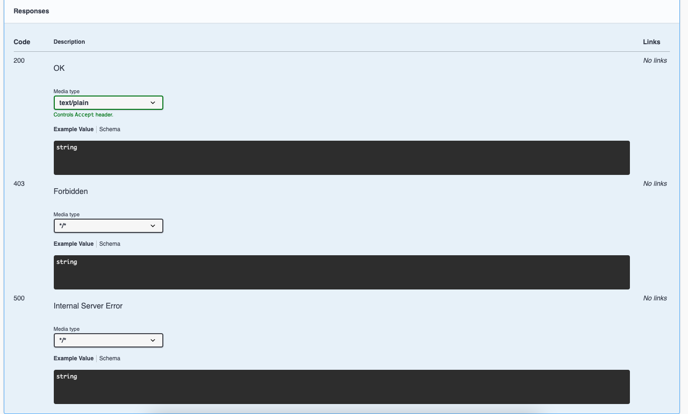
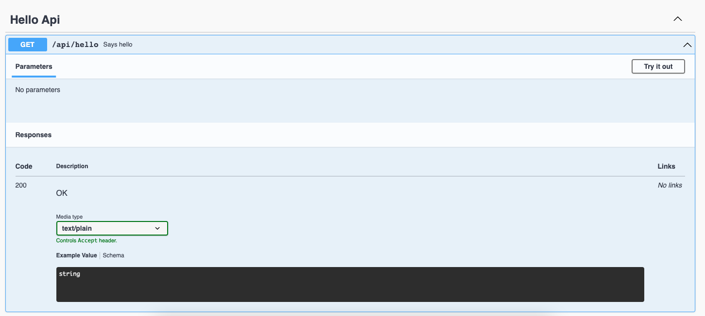

# springdoc-override-with-generic-response-regression
A repo for minimal demonstration of `springdoc.override-with-generic-response` regression.

The project has minimal dependencies and can be built via `mnv clean package`.  
Running the project can be done via the `Application` class in the IDE or via the command line `mvn clean spring-boot:run` 

## 1.6.7
Setting the version of `springdoc-openapi-ui` to `1.6.7` will result in the `springdoc.override-with-generic-response: true` property being honoured.  

This will add the `@ResponseStatus` values from `@ExceptionHandler` methods in *either* the HelloController (a `@RestController`) or GlobalExceptionHandler (a `@ControllerAdvice`) to the swagger doc.  

## 1.6.8
Setting the version of `springdoc-openapi-ui` to `1.6.8` (or higher) will result in the `springdoc.override-with-generic-response: true` property being **ignored**.  

